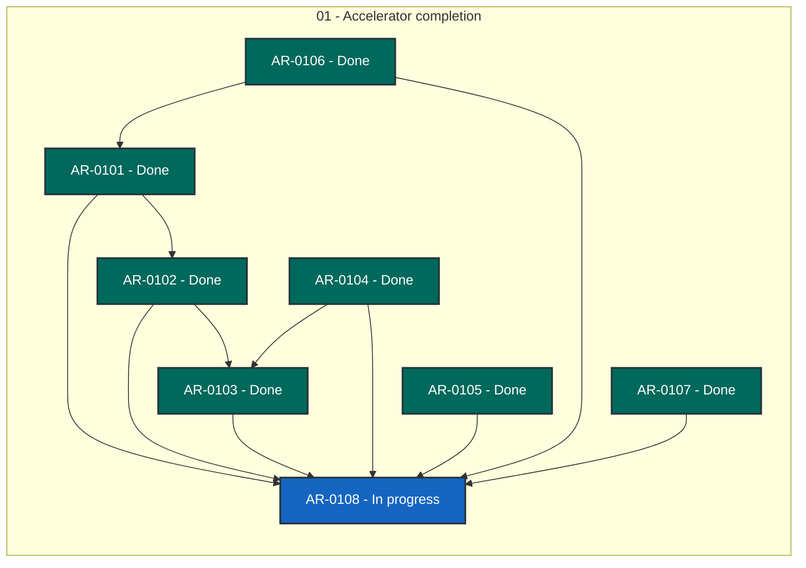

# Game Experiment status

> Generated deterministically from task front matter. Do not edit this file directly.
> Status records coordination progress; it is not evidence that product behavior is accepted.

## Portfolio overview

**8 ARs tracked** across 2 active status categories.

| Status | Meaning | Count |
| --- | --- | ---: |
| **In progress** | Claimed work with a live lease | 1 |
| **In review** | Submitted by its worker, awaiting a coordinator decision | 0 |
| **Open** | Dependency-ready and available to claim | 0 |
| **Blocked** | Cannot proceed until its recorded blocker clears | 0 |
| **Planned** | Defined work awaiting promotion or dependencies | 0 |
| **Future** | Deferred roadmap work | 0 |
| **Done** | Accepted, integrated, and durably verified | 7 |
| **Cancelled** | Stopped with a recorded rationale | 0 |
| **Superseded** | Replaced by another AR | 0 |

## Dependency graph

Arrows point from each prerequisite to the work that depends on it. Color is redundant
with the status text inside every node; the tables below are the complete text
alternative.

### Accessible dependency index

| AR | Prerequisites | Dependents |
| --- | --- | --- |
| [AR-0101](tasks/AR-0101.md) | [AR-0106](tasks/AR-0106.md) | [AR-0102](tasks/AR-0102.md), [AR-0108](tasks/AR-0108.md) |
| [AR-0102](tasks/AR-0102.md) | [AR-0101](tasks/AR-0101.md) | [AR-0103](tasks/AR-0103.md), [AR-0108](tasks/AR-0108.md) |
| [AR-0103](tasks/AR-0103.md) | [AR-0102](tasks/AR-0102.md), [AR-0104](tasks/AR-0104.md) | [AR-0108](tasks/AR-0108.md) |
| [AR-0104](tasks/AR-0104.md) | None | [AR-0103](tasks/AR-0103.md), [AR-0108](tasks/AR-0108.md) |
| [AR-0105](tasks/AR-0105.md) | None | [AR-0108](tasks/AR-0108.md) |
| [AR-0106](tasks/AR-0106.md) | None | [AR-0101](tasks/AR-0101.md), [AR-0108](tasks/AR-0108.md) |
| [AR-0107](tasks/AR-0107.md) | None | [AR-0108](tasks/AR-0108.md) |
| [AR-0108](tasks/AR-0108.md) | [AR-0101](tasks/AR-0101.md), [AR-0102](tasks/AR-0102.md), [AR-0103](tasks/AR-0103.md), [AR-0104](tasks/AR-0104.md), [AR-0105](tasks/AR-0105.md), [AR-0106](tasks/AR-0106.md), [AR-0107](tasks/AR-0107.md) | None |

## Complete AR inventory

### In progress (1)

| Priority | AR | Owner | Summary | Next action |
| --- | --- | --- | --- | --- |
| P1 | [AR-0108](tasks/AR-0108.md): Retire ACCELERATOR.md and repoint every reference | worker-ar0108 | With M1&#x27;s implementation done, delete ACCELERATOR.md. Move the one authoritative piece (kernel I/O layout) next to the code that defines it and repoint every doc, tool and source comment that cites it. | Claim after every other M1 AR is done; regenerate the reference list with git grep, since the implementation ARs will have moved lines. |

### Done (7)

| Priority | AR | Owner | Summary | Next action |
| --- | --- | --- | --- | --- |
| P0 | [AR-0101](tasks/AR-0101.md): World capacity: refuse overflow and grow between epochs | Unclaimed | RawMap::insert has no capacity check, so a write past World&#x27;s fixed 256 Ki slots is UB on the mapped path. Make overflow impossible and let a per-type buffer grow, re-binding descriptor sets. | Claim; add the capacity check and a failing growth test first, then implement growth with a per-map generation the accelerator re-binds on. |
| P0 | [AR-0102](tasks/AR-0102.md): Enforce one writer per slot per batch; repair the unsafe safety record | Unclaimed | The world storage&#x27;s 17 unsafe uses rest on &#x27;at most one writer per slot&#x27;, documented but unchecked. Check it on every GPU batch and bring every SAFETY comment in aristotle up to date. | Claim after AR-0101 lands; locate where each kind&#x27;s output columns are known in shaders.rs and add the write-set check with a planted-collision test. |
| P0 | [AR-0104](tasks/AR-0104.md): Accelerator worker: failure path, bounded submission, flush policy | Unclaimed | A Vulkan error panics the worker (dispatch(..).unwrap()), so callers only see WorkerGone; the channel is unbounded; every flush prints to stderr; batch composition is never varied in tests. | Claim; write the failing test for a forced submission error first. |
| P1 | [AR-0103](tasks/AR-0103.md): Cross-mechanism epoch driver with frozen structure and quiescence flush | Unclaimed | Nothing above Mechanism steps all mechanisms of an epoch; callers hand-roll join_all, structure can change mid-epoch, and the worker flushes on a 1 ns idle tick rather than on quiescence. | Claim after AR-0102 and AR-0104 land; design the driver API in the plan&#x27;s evidence first, then implement and migrate callers. |
| P1 | [AR-0105](tasks/AR-0105.md): Fix the two FIXME: deadlock? reproducers in the implicit solver | Unclaimed | dimension_change_reallocates_and_clears_the_hint and topology_change_causes_no_visible_jolt are #&#91;ignore&#93;d with &#x27;FIXME: deadlock?&#x27;. Suspected: a WorldKey dropped while world.write::&lt;T&gt;() is held. | Claim; run both ignored tests with a timeout to confirm the hang, then confirm or refute the suspected cause before changing code. |
| P2 | [AR-0106](tasks/AR-0106.md): Fatal semantics: size and count fatal slots from the trace | Unclaimed | Kernels write fatal operands into a fixed float fatal&#91;20&#93; (build.rs FIXME), and n_fatals per kind is hand-entered in shaders.rs. Derive both from the trace and pin the mark-and-continue semantics. | Claim; read build.rs fatal_map and the shaders.rs check table, then make build.rs emit the per-kind fatal count. |
| P3 | [AR-0107](tasks/AR-0107.md): Precision seam: measure f32 base poses far from the origin | Unclaimed | The shaders bind Motor&lt;f32&gt; base poses directly; ACCELERATOR.md Part V calls the precision of that narrowing unexamined. Islands re-anchor at their centre of mass; measure whether that suffices. | Claim; write a test that steps the same mechanism at the origin and translated far away and compares relative motion. |
